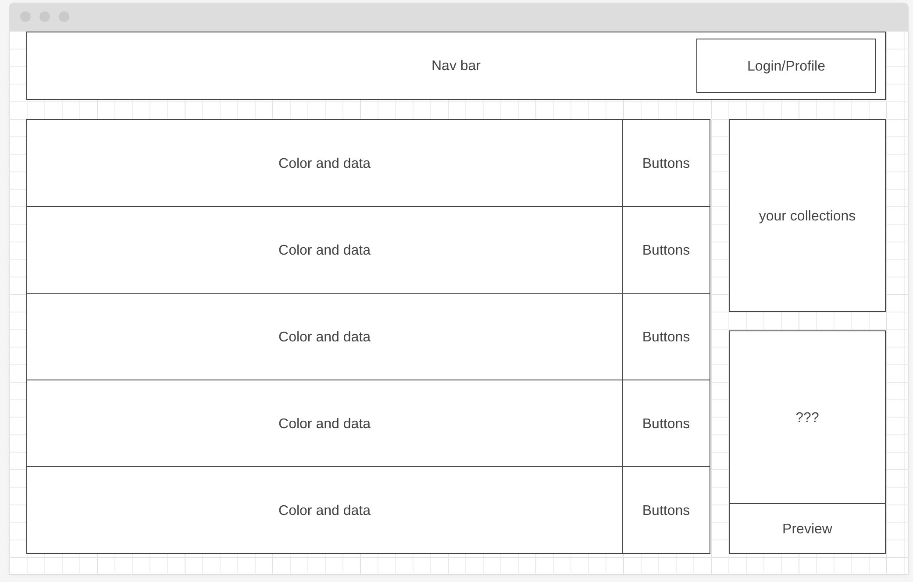

# ColorPalette

**Background**

    ColorPalette is a simple application that allows users to generate a colr schema for their webiste and or buisness theme. The site will allow the user to generate a random 5 colors that will use a certain algorithm to provide colors that compliment each other. The user is also able to input a color that they originally want and the generator will find the 4 other colors based off of the color provided.

    After the user selected their 5 or more color. There will be a preview button that will change the current website to match the colors that the user have selected. In addition to that the user is able to save their combinations. This means that they can create a certain numbers of palettes and can retain that information if they didn't like the current one they are generating.

**Functionality & MVP**

    In ColorPalette, uers will be able to:
        - Able to generate default of 5 colors
        - Able to preview it by injecting CSS into the website
        - Able to save collections of their previous selections
        - Able to lock colors that the user likes and generate colors around them 
    Bonus Features
        - Able to inject CSS to a few live sites.
        - Able to preview colors applied to templated website
        - Able to preview colors on a premade buisness card
        - Able to input an origianl color
        - Able to upload an image and allow the generator to pic out colors from it

**Wireframes**

    